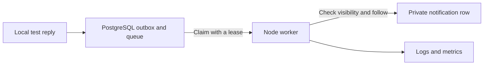

# Guide 1 — Learn locally with ProblemHunt and Docker

Start here. You already have Docker; do not buy cloud resources or install another Docker engine. This exercise uses your computer and introduces no Azure charges. It does not connect the public website to a new database.

Written 2026-09-30 against the repository's current notification lab. Commands below are for **PowerShell 7**, from `A:\REPO\ProblemHunt`. Allow two or three short study sessions; finish each exercise by explaining its result in your own words.

## 1. Understand what you will run

| Term | In this project |
| --- | --- |
| Image | The packaged Node worker and its dependencies, built from the Dockerfile |
| Container | A running instance of that image |
| Compose | Starts the lab's related services and connects them |
| `db` | A private local PostgreSQL database with synthetic records |
| `init` | A one-time initializer for this local database; exits successfully when done |
| `worker` | Processes pending notifications independently of a browser |
| Volume | Preserves database files when containers stop or restart |
| Secret file | A local password file kept outside Git and the image build context |



The queue and inbox live in the same local PostgreSQL database. This is a worker lab, not a complete local Supabase installation: it does not run real Supabase Auth, Storage or PostgREST. A browser pointed at your existing Supabase project will not automatically use this lab. Do not point test-write scripts at production.

## 2. Check tools and choose one Docker connection

```powershell
Set-Location A:\REPO\ProblemHunt
git branch --show-current
git status --short
node --version
npm --version
```

Use `feature/community-knowledge-platform` and preserve any work already present. Node **22** matches CI; changing Node is unnecessary if you only want to read first, but use 22 for reproducible host-side checks.

This machine previously ran Docker inside Ubuntu WSL. Check that connection:

```powershell
wsl -d Ubuntu -- docker version
wsl -d Ubuntu -- docker compose version
```

If it works, define this shortcut in **each PowerShell terminal** used below:

```powershell
function dc {
    & wsl -d Ubuntu --cd /mnt/a/REPO/ProblemHunt -- docker compose -f services/notifications/compose.yml @args
}
```

If you instead use Docker Desktop's Windows CLI, run `docker version` and `docker compose version`, then use this alternative shortcut:

```powershell
function dc {
    & docker compose -f services/notifications/compose.yml @args
}
```

Choose one engine for the whole exercise. Different engines may have different images/volumes. A missing Windows `docker` command does not mean the working WSL installation must be replaced.

## 3. Prepare and build

```powershell
npm run install:all
npm test --prefix services/notifications
npm test --prefix supabase/tests
npm run lab:prepare --prefix services/notifications
dc config --quiet
dc build
dc up --no-build
```

Stop and resolve a failed command before continuing. The last command stays attached to logs: leave that terminal open, especially when using WSL.

`lab:prepare` preserves existing ignored passwords and creates a small allowlisted build context. Re-run it after source changes. **Build from source now:** an earlier cancelled experiment left unverified Alpine images under local Compose tags; the committed Dockerfile was restored afterward. Do not simply start those cached tags.

Expected startup: `db` becomes healthy; `init` exits with code 0; `worker` emits `started` and `queue_snapshot` JSON. Historical baseline: five worker tests and 60 SQL scenarios pass. Counts can change with later commits; passing results matter more than matching a number.

The current committed image has unresolved scan findings (52 high, four critical OS-package findings in the saved report). This guide keeps it in the existing isolated local lab with no published ports. It is **not** a cloud release candidate; remediation/re-scanning is required before the Azure guide's paid stage.

## 4. Inspect a running service

Open a second PowerShell terminal, return to the repository and define the same `dc` shortcut.

```powershell
dc ps -a
dc logs --tail 30 worker
dc exec -T worker id
dc exec -T worker node --version
dc exec -T worker node -e "fetch('http://127.0.0.1:8080/health').then(r => console.log(r.status))"
dc exec -T worker node -e "fetch('http://127.0.0.1:8080/metrics').then(r => r.text()).then(t => console.log(t))"
```

Expect a non-root user, Node 22 and health status 200. There is intentionally no host port: opening `localhost:8080` on Windows is not the way to reach this worker. The commands execute inside its container.

Read these files alongside the running service:

- [Dockerfile](../services/notifications/Dockerfile): packaging, non-root execution and health check.
- [compose.yml](../services/notifications/compose.yml): dependencies, secrets and persistent volume.
- [worker.mjs](../services/notifications/src/worker.mjs): dispatch, claim, deliver and acknowledge.
- [telemetry.mjs](../services/notifications/src/telemetry.mjs): safe logs and metrics.

Explain: why does `init` exiting successfully not indicate a broken application? Why is an image different from a running container?

## 5. Break the database connection and recover

Keep the worker running:

```powershell
dc stop db
dc logs --tail 15 worker
dc exec -T worker node -e "fetch('http://127.0.0.1:8080/live').then(r => console.log(r.status))"
dc exec -T worker node -e "fetch('http://127.0.0.1:8080/health').then(r => console.log(r.status))"
```

Allow about 30 seconds for a failed cycle/probe transition. Expect `/live` 200 (the process responds), `/health` 503 (it cannot process work), and sanitized failure logs. Then:

```powershell
dc start db
dc logs --tail 20 worker
dc exec -T worker node -e "fetch('http://127.0.0.1:8080/health').then(r => console.log(r.status))"
```

Wait for database startup and another poll if necessary. Expect recovery to 200 **without restarting the worker**. A metrics snapshot may take another 30 seconds.

Explain: why should a database outage fail readiness but not automatically trigger a worker restart loop?

## 6. Prove crash recovery and failed-message handling

Stop the ordinary worker so it does not compete with the deterministic test harness. Keep `db` running:

```powershell
dc stop worker
dc run --rm --no-deps init node lab/verify.mjs
dc run --rm --no-deps init node lab/observe.mjs
```

The first drill checks real child-process crashes before and after writing a notification, duplicate prevention, stale leases, two simultaneous claims and hidden-content protection. The second deliberately introduces an unsupported event version, reaches the failure limit, denies worker-initiated replay, then uses the lab operator to repair/requeue it.

Expected second result: four scheduled retries, one exhausted failure, one recovered delivery, and exactly one inbox row. All attempts retain the same event correlation ID. The harness advances local retry availability to shorten the exercise; actual service backoff is unchanged.

If the drill asks you to drain prior work, run `dc start worker`, wait until logs show no pending work, then stop it again. Investigate genuinely failed records rather than resetting the database. The scripts create labelled synthetic records only in the local lab and retain them for inspection.

Explain: code can run twice after a crash. What database rule prevents the user seeing two notifications?

## 7. Prove data survives restart

With the ordinary worker still stopped:

```powershell
dc run --rm --no-deps init node lab/verify.mjs prepare-restart
dc restart db
dc start worker
dc run --rm --no-deps init node lab/verify.mjs check-restart
```

Wait for PostgreSQL to become ready after `restart db` before the final two commands. Expected result: the previously queued event is delivered once after restart. The named volume, not the worker container, preserves that state.

## 8. Finish the session

```powershell
dc stop
dc ps -a
git status --short
```

Leave the volume and ignored password files intact. Do not use `down -v`, prune volumes, or remove `.local` to solve an ordinary connection issue. Stop the foreground Compose terminal after confirming the services are stopped.

Record four short answers for yourself: what failed, which signal revealed it, how it recovered, and what proved there was no duplicate. You are ready for the next exercise when you can explain those answers without relying on the test script's summary.

## Common problems

| Symptom | Check |
| --- | --- |
| Docker connection fails | Start the engine you selected; confirm WSL/Desktop context rather than installing another engine |
| `init` fails or says partial/nonempty database | Read its logs; preserve the volume and inspect migration state, do not reset it |
| Password authentication fails after files were removed | Password files and existing volume may no longer match; restore the correct local files, never print them in chat |
| Worker is healthy but no notifications appear | Idle is normal; the lab does not receive public website traffic, so use the local fixture drills |
| Changes are absent in the container | Re-run `lab:prepare`, build, then recreate via `dc up --no-build` |
| Website says community service is not ready | That can be an unmigrated hosted backend; this worker lab does not migrate or repair it |

## Resources and what comes next

Read [Docker's container explanation](https://docs.docker.com/get-started/docker-concepts/the-basics/what-is-a-container/) before step 3 and the [Compose quickstart](https://docs.docker.com/compose/gettingstarted/) after step 4. Use the [repository operations runbook](community-session-06-operations.md) for queue/lease details.

For later local Kubernetes learning, study [Kubernetes basics](https://kubernetes.io/docs/tutorials/kubernetes-basics/) and [kind](https://kind.sigs.k8s.io/docs/user/quick-start/). ProblemHunt's Kubernetes manifests/exercises are **not implemented yet**; completing this Docker guide does not mean Session 08 is complete. Do not create AKS to practise those basics.

When you want a short paid managed-cloud exercise, read [Guide 2](AZURE_SHORT_EXERCISE_GUIDE.md) first. There is no need to move the public website or maintain a permanent paid lab.
